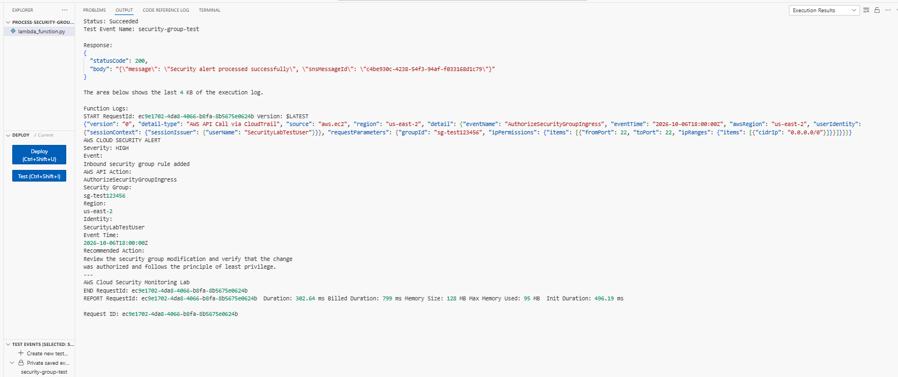
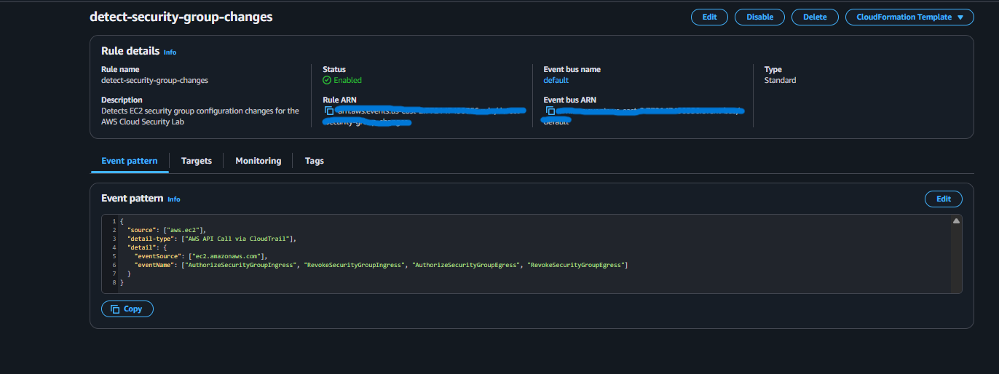
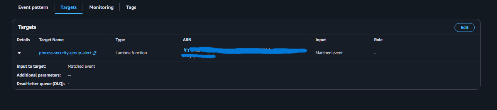
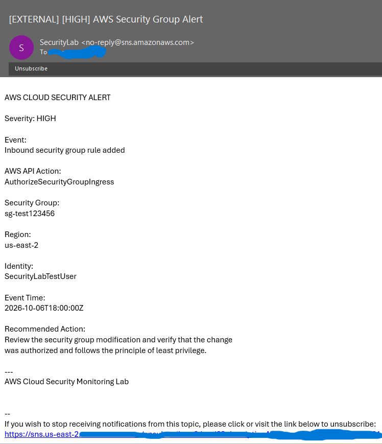

# AWS Cloud Security Monitoring & Automated Alerting Lab

## Overview

This project is a hands-on AWS cloud security monitoring system that detects changes made to EC2 Security Groups and automatically generates security alerts.

The goal was to build an event-driven detection pipeline using native AWS services rather than relying on manual log review.

When a monitored Security Group change occurs, the system captures the activity, analyzes the event using a Python Lambda function, assigns a severity level, and sends a real-time email alert to a security analyst.

## Architecture


```text
EC2 Security Group Change
          |
          v
     AWS CloudTrail
          |
          v
    Amazon EventBridge
          |
          v
      AWS Lambda
    (Python Analysis)
          |
          v
      Amazon SNS
          |
          v
     Email Alert

```

## Event Flow

1. A user modifies an EC2 Security Group.
2. AWS CloudTrail records the API activity.
3. Amazon EventBridge detects monitored Security Group API calls.
4. EventBridge invokes an AWS Lambda function.
5. Lambda parses the CloudTrail event and determines the alert severity.
6. Amazon SNS publishes the security alert.
7. The subscribed security analyst receives the alert by email.

## AWS Services Used

- **Amazon EC2** — Security Groups provide the resources being monitored.
- **AWS CloudTrail** — Records security-related AWS API activity.
- **Amazon EventBridge** — Detects specific Security Group API events.
- **AWS Lambda** — Processes events and performs security analysis using Python.
- **Amazon SNS** — Delivers real-time security notifications.
- **Amazon CloudWatch** — Provides Lambda logs, execution details, and troubleshooting data.
- **AWS IAM** — Controls permissions between AWS services.

## Detection Logic

The EventBridge rule monitors the following EC2 API actions:

```text
AuthorizeSecurityGroupIngress
RevokeSecurityGroupIngress
AuthorizeSecurityGroupEgress
RevokeSecurityGroupEgress
```

These events represent changes to inbound or outbound Security Group rules.

The Lambda function analyzes each event and extracts information such as:

- API action
- Security Group ID
- AWS Region
- Identity that performed the action
- Event timestamp
- IP ranges
- Port ranges

## Severity Classification

The Lambda function includes detection logic to identify potentially dangerous network exposure.

### MEDIUM

Standard Security Group configuration changes are classified as **MEDIUM** severity.

### HIGH

An alert is upgraded to **HIGH** severity when SSH (port 22) or RDP (port 3389) is exposed to:

```text
0.0.0.0/0
```

This represents remote administrative access being opened to the public internet.

## Example Alert

```text
AWS CLOUD SECURITY ALERT

Severity: HIGH

Event:
Inbound security group rule added

AWS API Action:
AuthorizeSecurityGroupIngress

Security Group:
sg-example

Region:
us-east-2

Identity:
SecurityLabTestUser

Recommended Action:
Review the security group modification and verify that the change
was authorized and follows the principle of least privilege.

---
AWS Cloud Security Monitoring Lab
```

## Testing

The system was tested in two stages.

### Lambda Test

A simulated CloudTrail event was sent directly to Lambda representing SSH port 22 being opened to `0.0.0.0/0`.

Lambda successfully:

- Parsed the security event
- Identified the Security Group change
- Classified the event as HIGH severity
- Published the alert to SNS
- Triggered an email notification

### End-to-End Test

A real Security Group rule was modified in AWS to verify the complete automated workflow.

The complete pipeline successfully executed:

```text
Security Group Change
        ↓
    CloudTrail
        ↓
   EventBridge
        ↓
     Lambda
        ↓
       SNS
        ↓
   Email Alert
```

This confirmed that the detection and alerting workflow operated automatically without manually invoking the Lambda function.

## Test Evidence

The following screenshots document the detection pipeline and successful end-to-end alert delivery.

### 1. High-Severity Lambda Detection

A simulated CloudTrail event representing SSH (port 22) exposed to `0.0.0.0/0` was processed by the Lambda function. The function successfully classified the event as **HIGH severity** and published the alert to Amazon SNS.



### 2. EventBridge Detection Rule

The EventBridge rule monitors CloudTrail for EC2 Security Group ingress and egress modifications. The rule is enabled and configured to detect four Security Group API actions.



### 3. EventBridge to Lambda Integration

Matched security events are forwarded from EventBridge to the `process-security-group-alert` Lambda function for analysis.



### 4. Security Alert Delivery

After Lambda analyzes the event, Amazon SNS delivers the formatted alert by email. The test below demonstrates a **HIGH-severity** alert generated after detecting simulated public SSH exposure.



### Validation Result

The successful tests verified the complete event-driven workflow:

```text
Security Group Change
        ↓
AWS CloudTrail
        ↓
Amazon EventBridge
        ↓
AWS Lambda
        ↓
Severity Analysis
        ↓
Amazon SNS
        ↓
Email Alert
```
**Result: End-to-end security detection and alerting successfully validated.**
## Troubleshooting & Validation

During development, Amazon CloudWatch logs and AWS service metrics were used to troubleshoot and validate the event pipeline.

Testing included:

- EventBridge event matching
- EventBridge-to-Lambda invocation
- Lambda resource-based permissions
- IAM execution permissions
- Lambda event parsing
- SNS publishing
- Email subscriptions
- End-to-end alert delivery

Testing each component independently made it possible to isolate failures before validating the complete pipeline.

## Incident Response

Detection is only the first step of the security monitoring process. This project also includes an incident response runbook that documents how an analyst should investigate and respond to Security Group alerts.

The runbook covers:

- Alert triage
- Security Group investigation
- CloudTrail identity validation
- Risk assessment
- Authorized vs. unauthorized changes
- Remediation procedures
- Escalation considerations

📘 **[View the Security Group Incident Response Runbook](docs/incident-response.md)**

## Security Concepts Demonstrated

This project demonstrates practical experience with:

- Cloud security monitoring
- AWS audit logging
- Detection engineering
- Event-driven security automation
- Network security
- Serverless architecture
- IAM and least privilege
- Incident alerting
- Python automation
- Security event analysis
- Cloud troubleshooting

## Future Improvements

Future versions of this project could include:

- AI-generated incident summaries using Amazon Bedrock
- Microsoft Teams or Slack alerting
- Automated Security Group remediation
- Additional CloudTrail detections
- DynamoDB incident tracking
- Infrastructure as Code using Terraform or AWS CloudFormation
- Expanded severity scoring
- Security dashboards and metrics

## Disclaimer

This project was created in a controlled AWS lab environment for educational and portfolio purposes.
